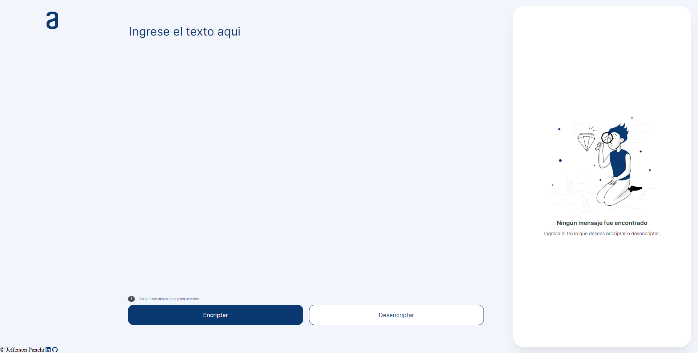
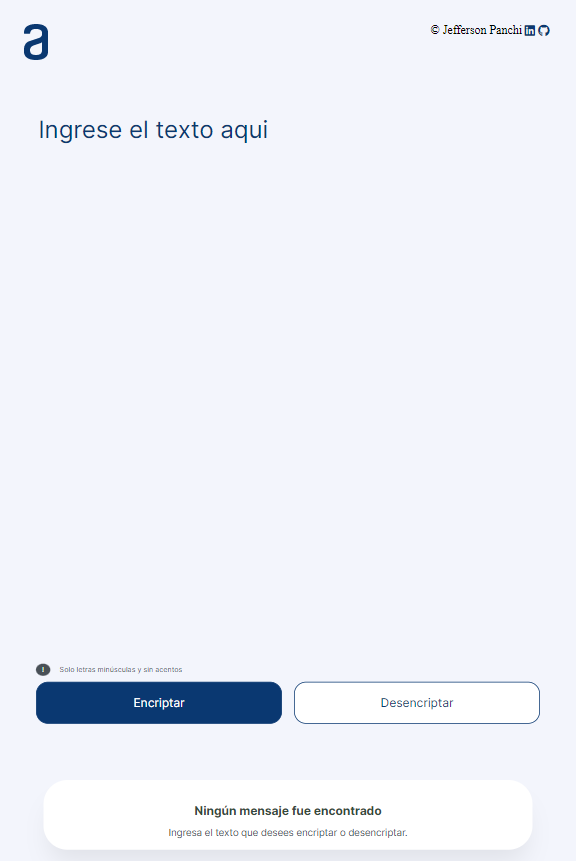
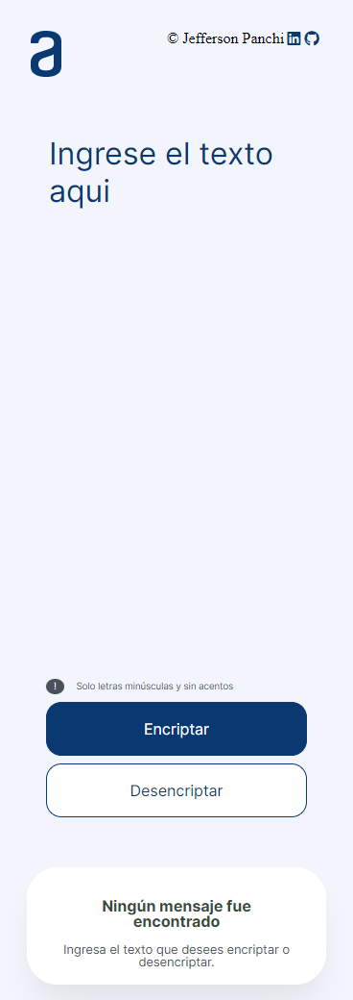

# 💻Challenge ONE | Encriptador de texto

     

## 🖊️ Tecnologías 
- HTML
- CSS
- JAVASCRIPT

## ✏️ Descripción
Encriptador de texto

**Llaves**
<pre>
La letra "e" es convertida para "enter"
La letra "i" es convertida para "imes"
La letra "a" es convertida para "ai"
La letra "o" es convertida para "ober"
La letra "u" es convertida para "ufat"
</pre>

**Requisitos:**
- Debe funcionar solo con letras minúsculas y sin acentos
- Debe ser posible convertir una palabra para la versión encriptada también devolver una palabra encriptada para su versión original.